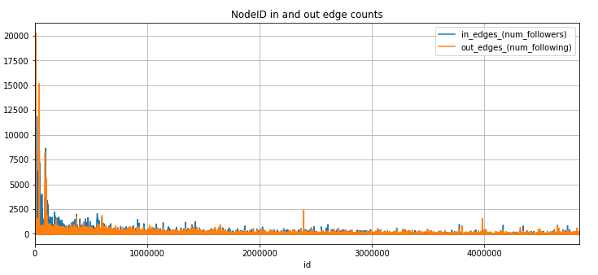
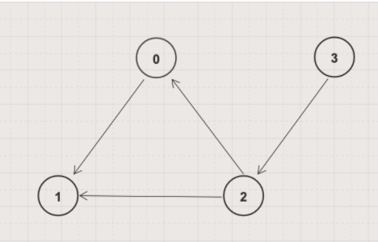
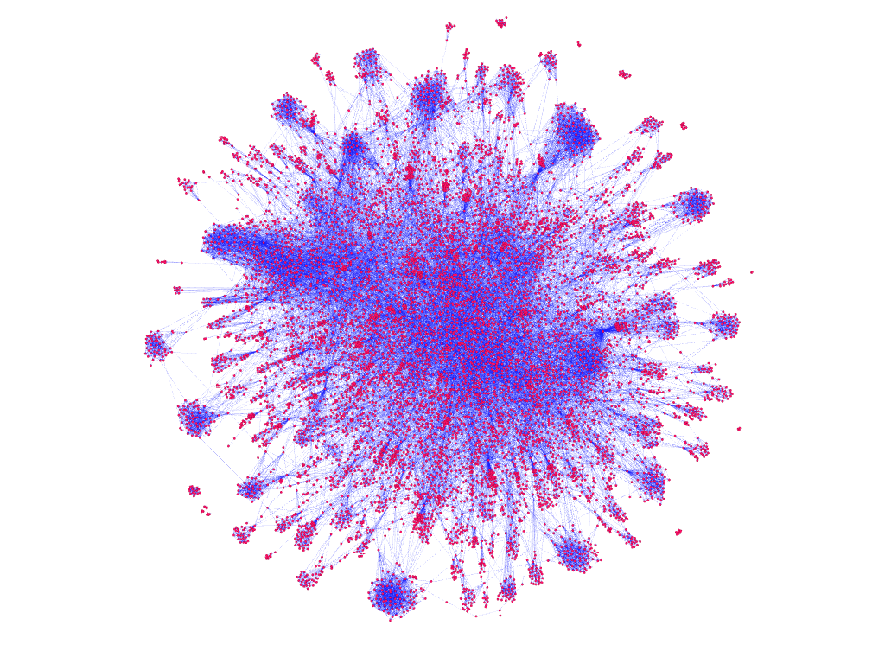
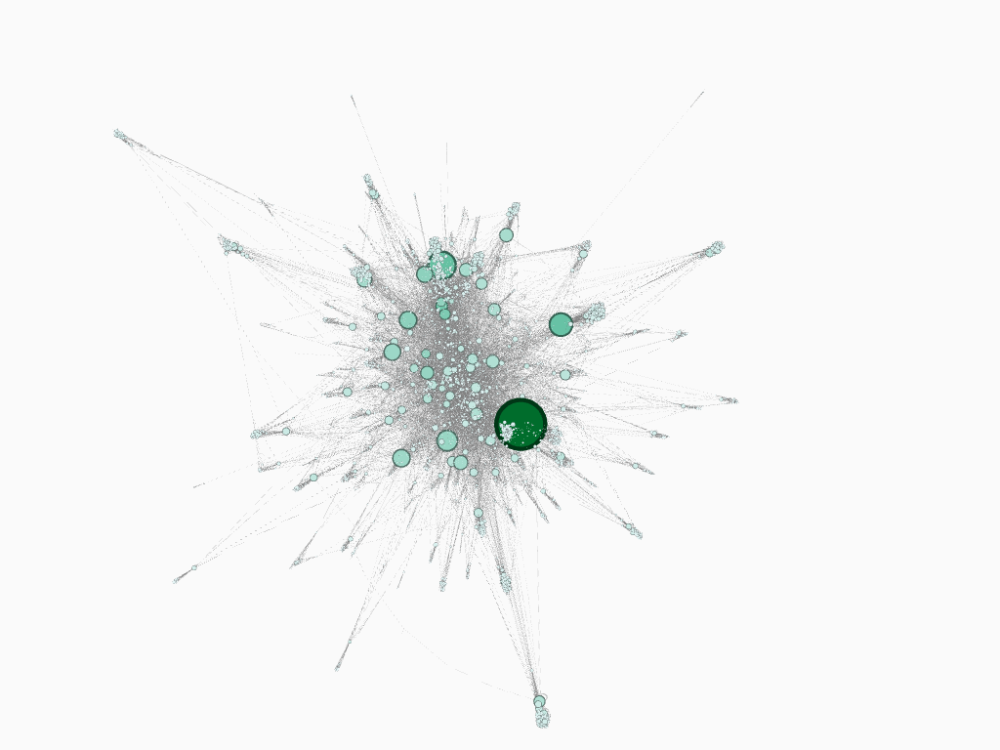
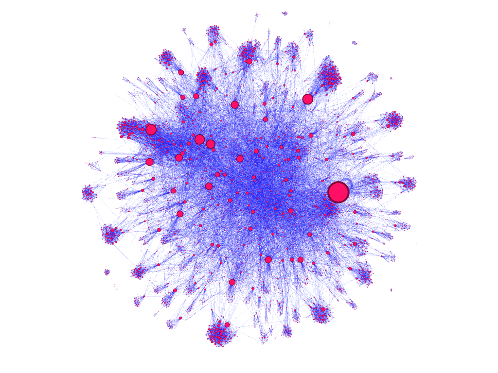
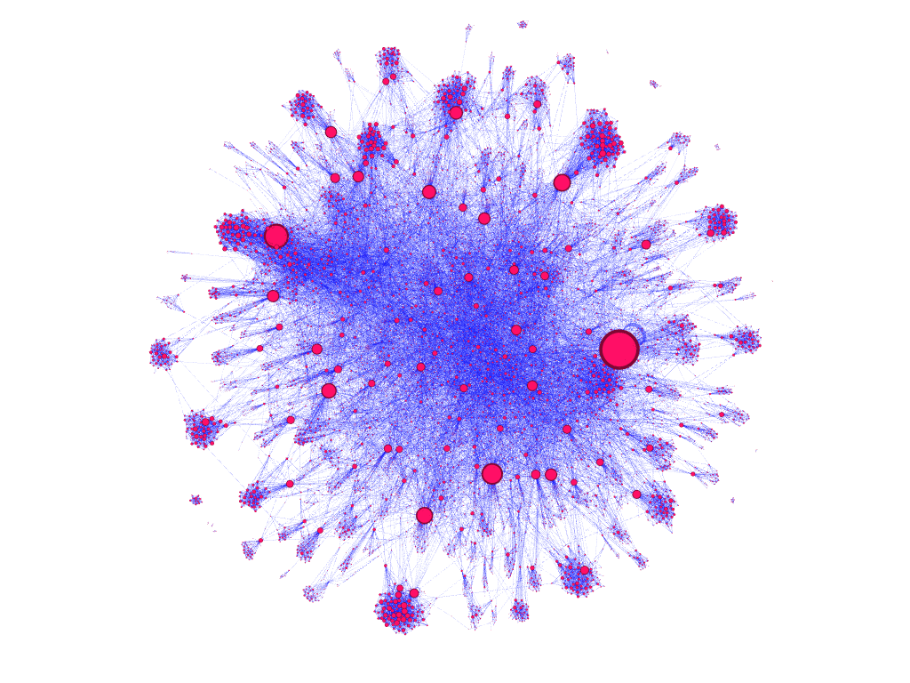
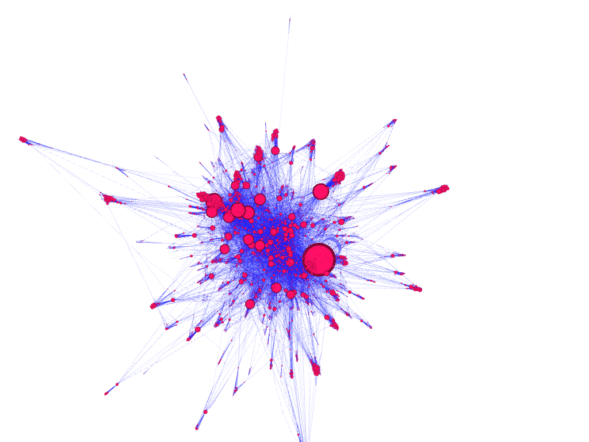
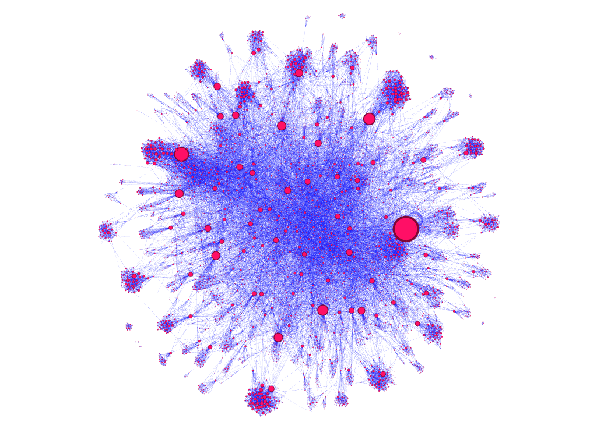

---
# Feel free to add content and custom Front Matter to this file.
# To modify the layout, see https://jekyllrb.com/docs/themes/#overriding-theme-defaults

layout: default
---

# Fall 2020 - CS 6240 - Term Group Project - Team 10

CS 6240: Large-Scale Parallel Data Processing   
Khoury College of Computer Sciences   
Northeastern University   

[Course Website](https://www.ccs.neu.edu/home/mirek/classes/2020-F-CS6240/)

**Team Members:**
* April Gustafson
* Mason Leon
* Matthew Sobkowski

This site is a GitHub Pages version of our final project, report, and presentation.

**Materials:**
* [GitHub Repository](https://github.com/masonleon/largescale-spark-graph-analytics)
* [12/11/2020 Project Submission Release](https://github.com/masonleon/largescale-spark-graph-analytics/releases/tag/v1.0)
* [PDF Final Report Submission](./files/CS6240Fall2020ProjectTeam10_GustafsonLeonSobkowski-report.pdf)
* [PDF Presentation Slide Deck](./files/CS6240Fall2020ProjectTeam10_GustafsonLeonSobkowski-slides.pdf)

**Presentation:**
<video controls width='100%'>
  <source src='files/CS6240Fall2020ProjectTeam10_GustafsonLeonSobkowski-presentation.mp4'
          type='video/mp4'>
  <p>
    Your browser doesn't support HTML5 video. Here is a
    <a href='files/CS6240Fall2020ProjectTeam10_GustafsonLeonSobkowski-presentation.mp4'>
      link to the video
    </a>
    instead.
  </p>
</video>
<br>
<br>


## Project Overview

As a group, we were interested in focusing on Spark usage for graph analytics.
We chose to use a social network graph due to their growing influence in the world, and how widely used they are in a variety of industries.
We specifically chose the all-pairs shortest path and non-trivial graph statistics tasks for this project.

### Tech Stack

<ul class="logos">
  <li class="logo-wrapper">
    <a href="https://wiki.openjdk.java.net/display/jdk8u/Main">
      
      <div>v1.8.0_265</div>
    </a> 
  </li>
  <li class="logo-wrapper">
    <a href="https://scala-lang.org/download/2.11.12.html">
      
      <div>v2.11.12</div>
    </a>
  </li> 
  <li class="logo-wrapper">
    <a href="https://hadoop.apache.org/docs/r2.9.1/">
      
      <div>v2.9.1</div>
    </a>
  </li>     
  <li class="logo-wrapper">
    <a href="https://spark.apache.org/docs/2.3.1/">
      
      <div>v2.3.1 (without bundled Hadoop)</div>
    </a>
  </li>
  <li class="logo-wrapper">
    <a href="https://maven.apache.org/ref/3.6.3/">
      
      <div>v3.6.3</div>
    </a>
  </li>
  <li class="logo-wrapper">
    <a href="https://docs.docker.com/">
      
      <div>Docker</div>
    </a>
  </li>
  <li class="logo-wrapper">
    <a href="https://almond.sh/docs/0.6.0/intro">
      
      <div>Almond v0.6.0</div>
    </a> 
  </li>
  <li class="logo-wrapper">
    <a href="https://jupyter.org/documentation">
      
      <div>Project Jupyter</div>
    </a>
  </li>
  <li class="logo-wrapper">
    <a href="https://docs.aws.amazon.com/emr/index.html">
    <div class="logo-aws">
      
      
    </div>
      <div>AWS EMR v5.17.0 on EC2</div>
    </a>
  </li>
  <li class="logo-wrapper">
    <a href="https://docs.aws.amazon.com/s3/?id=docs_gateway">
      <div class="logo-aws">
        
        
      </div>
      <div>AWS S3</div>
    </a>
  </li>
  <li class="logo-wrapper">
    <a href="https://gephi.org/users/quick-start/">
      
      <div>v0.9.2</div>
    </a>
  </li>
</ul>
  
## Input Data

The input data we are working with is the ​[LiveJournal social network dataset from Stanford​ University](https://snap.stanford.edu/data/soc-LiveJournal1.html).
LiveJournal is a free on-line community with almost 10 million members; a significant fraction of these members are highly active.
(For example, roughly 300,000 update their content in any given 24-hour period.)
LiveJournal allows members to maintain journals, individual and group blogs, and has friendship networks.
This set has 4,847,571 nodes with 68,993,773 edges.


### Dataset Exploration

Using Spark locally, we explored the LiveJournal dataset to:
- Gain a better idea of the number of edges per node.
- Verify that the number of id’s matched the number of nodes indicated in the dataset documentation.
- Verify that the sequence of sorted id’s was consecutive and did not contain large gaps.
- Insight into the dataset distribution.

We proceeded to plot the in and out edge counts to visualize the results using bar charts and a basic histogram for distribution.
This high-level evaluation gave us a good idea of the dataset.



Because the lower user id’s appeared much more active than higher number user ids we set our filtering of the data in Spark to focus on the lower numbered user id’s.

Please visit the links below to view our entire exploratory data analysis:
*   [Local Spark Exploration code](https://github.com/masonleon/largescale-spark-graph-analytics/blob/37a47bfdc2e67534a792c79c8a58fe33a385885a/src/main/scala/experiments/Stats.scala)
*   [Jupyter Notebook code](https://github.com/masonleon/largescale-spark-graph-analytics/blob/37a47bfdc2e67534a792c79c8a58fe33a385885a/notebooks)
*   [Exploratory graphs](https://github.com/masonleon/largescale-spark-graph-analytics/blob/37a47bfdc2e67534a792c79c8a58fe33a385885a/data/stats)


## All-Pairs Shortest Path (Spark)

### Overview

The goal of this task is to find the minimum distance from any node to all other nodes in the graph.
For a graph like the LiveJournal social network, where each node represents a user and each edgerepresents friendship/followership, the _all-pairs shortest path (APSP)_ data would represent the minimum “degree of separation” between each user.
APSP can be used to determine “betweennesscentrality”, which is a measure for quantifying the control of a human on the communication betweenother humans in a social network, or to determine graph “diameter”, which is a measure of network size.

There are a number of different algorithms to determine APSP.
For a graph with directed, unweightededges, like the LiveJournal social network, APSP can be computed by using a _breadth first search (BFS)_ traversal to find the _single-source shortest path (SSSP)_ for every source node.

BFS is an iterative graph search algorithm where each iteration extends the set of known paths from the source by exploring all out-edges from newly visited nodes.
For example, consider performing a BFS traversal on the graph below with node 2 as the source node.



| Iteration    | Paths from Source                                                                               |
|:-------------|:----------------------------------------------------------------------------------------------- |
| 1            | 2 → 0, distance = 1 <br> 2 → 1, distance = 1                                                    |
| 2            | 2 → 0, distance = 1 <br> 2 → 1, distance = 1 <br> 2 → 0 → 1, distance = 2 // Not shortest to 1! |
| Final result | 2 → 0, distance = 1 <br> 2 → 1, distance = 1                                                    |

Repeating this with every node as the source node yields the shortest paths for all pairs of nodes.
We use this approach as the basis for our parallel processing algorithm.


### Pseudo-Code

[ShortestPath Scala Code](https://github.com/masonleon/largescale-spark-graph-analytics/blob/37a47bfdc2e67534a792c79c8a58fe33a385885a/src/main/scala/ShortestPath)

#### Version 1 - |V| Iterations

The APSP via BFS approach is guaranteed to converge after |V| iterations.
Our first approach used this intuition to manage the iterative portion of the algorithm.

```scala
graph = sc.textFile(input file)
  // Input file: (userID, friendID)
  .map {
    line => (line(0), line(1))
  }
  // Graph structure: (userId, List(friends))
  .groupByKey()
  // Graph structure is static →  persist or cache
  .cache()

// Distances structure: (toId, (fromId, distance))
// This data will change each iteration
// Set all distances for "first hop" to 1
distances = graph
  .flatMap {
    case (fromId, adjList) => adjList
      .map(
        adjId => (adjId, (fromId, edgeWeight))
      )
  }

// Guaranteed to find the shortest path
// after k iterations when k = |V|
for (iteration <- 0 to k) {
  // Join distances to graph to go to the next adjacent nodes
  // After join: (toId, (Option[adjList], (fromId, distance)))
  distances = graph
    .rightOuterJoin(distances)
    // Pass distance to adj nodes (see below)
    .flatMap(
      x => updateDistances(x)
    )
    // Only keep min distance for any (to, from)
    .reduceByKey(
      (x, y) => min(x, y)
    )
    // Transform back to distances structure
    .map {
      ((toId, fromId), distance) => (toId, (fromId, distance))
    }
}

------Helper Method-------
// This method passes along and accumulates distances
// from any node to its adjacent nodes.
// The method takes a row of (toId, (adjList, (fromId, distance)))
// and expands it into a new row for
// every ID in the adjacency list with updated
// distances for each ID.
// The data in the original row is maintained and
// returned with the new rows.
updateDistances(row):
  row match {
    case (toId, (Some(adjList), (fromId, distance))) => adjList
      .map(
        newId =>((newId, fromId), edgeWeight + distance)
      ) ++ List(((toId, fromId), distance))

    case (toId, (None, (fromId, distance))) => List(((toId, fromId), distance))
  }
```


##### Version 2 - Check for convergence

In the APSP BFS approach, the program has converged if, for a given iteration, no new (path, distance) has been added.
Depending on the graph, determining convergence by this approach is vastly more efficient than running |V| iterations.
To implement this, we made a few changes in the distances data structure and the iterative computations.

```scala
// Now distances has a different key structure: ((toId, fromId), distance)
// Iterate until there are no updated distances in an iteration
// numUpdated == 0 means convergence!
while (numUpdated > 0) {
  temp = distances
    .map {
      case ((toId, fromId), distance) => (toId, (fromId, distance))
    }
    // Go to the next “hop” in the graph
    .leftOuterJoin(graph)
    .flatMap(
      x => updateDistances(x)
    )
    // Keep min distance for any (to, from) pair
    .reduceByKey(
      (x, y) => Math.min(x, y)
    )

  // Check if any new distances have been added
  numUpdated = temp
    // ((to, from), (newDist, Option[oldDist]))
    .leftOuterJoin(distances)
    .filter(oldDistance.isEmpty)
    .count()

  // Reset updated distances
  distances = temp
}
```

#### Version 3 - Use same partitioner for graph and distances

Since we are repeatedly joining the graph and distances data, we thought we would try to optimize the join by explicitly using the same partition on these two data structures.
This was our initial approach:

```scala
if (optimize) {
  val graphPartitioner = graph.partitioner match {
    case Some(p) => p
    case None => new HashPartitioner(GraphRDD.partitions.length)
  }
  distances.partitionBy(graphPartitioner)
}
```

We ran our program on AWS with this optimization in place.
However, we later realized, with this format, the distances data structure does not have the same key as the graph data structure (before we join, we map distances to have the same key structure as graph).


#### Version 4 - Refactor distance key structure and use same partitioners

We then changed the distances structure to have the same key structure as the graph when we assigned the partitioner, which required a bit of fiddling with the iterative computations:

```scala
// distances format starts as (to, (from, distance)) to join with graph
```


#### Version 5 - Simplify checking for new paths to determine convergence

We were using a join between distances and temp (updated distances) to identify updated distances after each iteration and determine convergence.
However, in our unweighted graph, the first path (v, u) from any node u to any node v is guaranteed to be the shortest path, so there is no need to check if the distance for (v, u) has been updated after any iteration.
We just need to check if a new path has been added.
After running on AWS a few times, we realized that we could probably improve performance by finding the count difference between distances and temp instead of performing a join:

```scala
numUpdated = temp.count() - distances.count()
```


#### Version 6 - Partition temp structure with graph partitioner

In version 4, we explicitly partitioned the distances structure with the graph structure to optimize the join between these two structures.
However, in each iteration, the distance structure is transformed into ‘temp’ before joining with graphs again -  does it still have the partition we assigned it?
We decided to try resetting the partitioner in every iteration:

```scala
distances = temp
  .map(
    x => (x.to, (x.from, x.distance))
  )
  .partitionBy(graphPartitioner)
```


### Algorithm and Program Analysis

The non-parallel version of SSSP on a directed, unweighted graph using BFS has a runtime complexity of O(|V| + |E|).
To compute APSP, SSSP must be computed once for each source node, which increases the runtime complexity to O(|V|​2 ​+ |V||E|).
For large graphs, like our LiveJournal social network, where |E| = 68993773 and |V| = 4847571, computing APSP is significantly complex.
Does our parallel program improve performance?

While it is difficult to estimate the runtime in parallel, we can consider the amount of network traffic generated by our algorithm:

<table>
    <tr>
      <td>
        <b>Graph Stats</b>
      </td>
      <td>
        |E| = ​68993773
      </td>
      <td>
        |V| = ​4847571
      </td>
      <td>
        Diameter = 16
      </td>
    </tr>
    <tr>
      <td>
        <b>Data transferred from input file into</b>
        <br>
        <code>graph</code>
      </td>
      <td colspan="3">O(|E|)</td>
    </tr>
    <tr>
      <td>
        <b>Rows contained in</b>
        <br>
        <code>distances</code>
      </td>
      <td colspan="3">
        O(|V|<sup>2</sup>)
      </td>
    </tr>
    <tr>
      <td>
        <b>Data shuffled to expand graph​</b>
        <br>​
        <code>graph.join(distances)</code>
      </td>
      <td>
        O(|E|) + O(|V|<sup>2</sup>)
      </td>
      <td>
        Version 4: we believe this amount decreased when we used the same key type and partitioner for graph and distances (runtime decreased from version 3)
      </td>
      <td>
        Version 6: we believe this amount decreased further by resetting the partitioner after every update to distances (runtime decreased from version 5)
      </td>
    </tr>
    <tr>
      <td>
        <b>Data shuffled to identifynewly discovered path</b>
        <br>
        <code>temp.join(distances)</code>
      </td>
      <td>
        O(2|V|<sup>2</sup>)
      </td>
      <td colspan = "2">
        Version 5: No shuffling necessary!
      </td>
    </tr>
    <tr>
      <td>
        <b>Number of iterations</b>
      </td>
      <td colspan="3">
        O(|V|)
        <br>
        <br>
        We know that the longest shortest path is 16. So the full dataset should converge after 16 iterations.
        <br>
        We weren’t sure if using a subset of the data would change this value, but using a simple filter=10,000 did require exactly 16 iterations.
      </td>
    </tr>
</table>

We can also consider possible speedup, load balance, and scaling for different aspects of our program: 
- <code>updateDistances​</code> to expand paths
  - This computation is where parallel processing shows the most potential for improved performance over non-parallel computations.
    The next “wave” from every node is beingprocessed in parallel.
    As the number of outgoing edges from each node increases, the amount of data processed in parallel increases.
    If each node did not have very many outgoing edges (e.g. a binary tree), there probably would not be much gain from our parallel approach.
  - The key for this computation represents a distinct node.
    Nodes with a greater number of adjacent nodes require greater computation time; therefore, load imbalance could arise if many nodes with large adjacency lists are partitioned to the same worker.
  - Since each key is a distinct node, scaling up with more machines could speed up this computation if the number of distinct nodes is greater than the number of machines.


- <code>reduceByKey</code>​ to only keep the minimum distance for any (to, from) pair in distances
  - This computation eliminates any non-minimum distances from any path (v, u) starting from node u and ending at node v.
    In a non-distributed APSP BFS approach, this computation wouldn’t really be necessary because as soon a path from (v, u) is found, it is guaranteed to be the shortest and, while traversing the graph from u, it is feasible to keep track of the fact that v has already been visited from u and not visit it again.
    In our implementation, this computation is necessary because we are not able to see that v has already been visited from u when expanding the path.
    We need to investigate further to see if our parallel approach could be improved here.
  - The key for this computation represents a distinct path (v, u) starting from node u and ending at node v.
    A greater number of updates in one iteration to a single path leads to greater computation time for that path; therefore, load imbalance could arise if many paths with a large number of updates are partitioned to the same worker.
    However, since this key is more fine-grained than the key for <code>updateDistances</code>, this load imbalance is less likely.
  - Since each key is a distinct path, scaling up with more machines could speed up this computation if the number of distinct paths is greater than the number of machines.


### Experiments


#### Version 3, cluster size constant (4 workers + 1 master), varying simple filter

| Filter          | Runtime                            |
|:----------------|:---------------------------------- |
| Filter = 100    | 22:03:17 - 22:03:58 = ​**00:00:41** |
| Filter = 10,000 | 22:15:41 - 02:01:25 = ​**03:45:44** |


#### Version 3, simple filter size constant (filter = 10,000), varying cluster size

| Cluster Size                         | Runtime                            |
|:-------------------------------------|:---------------------------------- |
| Small cluster (4 workers + 1 master) | 22:15:41 - 02:01:25 = ​**03:45:44** |
| Large cluster (6 workers + 1 master) | 15:02:30 - 18:01:11 = ​**02:58:41** |


#### Cluster (7 workers + 1 master) and simple filter (filter = 10,000) constant, varying versions

| Version   | Runtime                            |
|:----------|:---------------------------------- |
| Version 3 | 15:02:30 - 18:01:11 = **​02:58:41** |
| Version 4 | 01:20:09 - 03:59:49 =​ **02:39:40** |
| Version 5 | 11:16:03 - 13:40:24 = ​**02:24:21** |
| Version 6 | 14:26:00 - 16:38:16 = ​**02:12:16** |

Each successive version demonstrated greater speedup, indicating that co-partitioning joined data structures does decrease runtime.
These data structures must have the same key type and the partitioner may need to be reassigned to a data structure after it undergoes a transformation.


### Results Sample

[AWS EMR Logs](https://github.com/masonleon/largescale-spark-graph-analytics/blob/37a47bfdc2e67534a792c79c8a58fe33a385885a/results)

<table>
  <th>
    Results Sample from Version 1-3
  </th>
  <th>
    Results Sample from Version 4-6
  </th>
  <tr>
    <td>
      <b>((toId, fromId), distance)</b>
      <br>
      ((1085,4397),5)
      <br>
      ((2552,8438),5)
      <br>
      ((3299,812),8)
      <br>
      ((896,9002),7)
      <br>
      ((765,7612),4)
    </td>
    <td>
      <b>((toId, fromId), distance)</b>
      <br>
      (8477,(7865,7))
      <br>
      (8637,(184,7))
      <br>
      (2033,(8585,6))
      <br>
      (7600,(1218,6))
      <br>
      (2671,(371,5))
      <br>
      (3948,(2875,4))
    </td>
  </tr>
</table>


## Non-Trival Graph Statistics (Spark)

### Overview

The goal of this task is to find the diameter and largest cycle of a social network graph.
The diameter is defined as the longest path in the set of all-pairs shortest paths in the graph and is a common measure of network size.
In a social network graph, a small diameter would indicate a high degree of connectivity between members (no one person has too many degrees of separation from another).

In addition, the largest cycle of the graph is the longest directed trail in which the only repeated vertices are the first and last vertices.
Specifically, information changes can be observed when travelling from source user through the cycle, and ultimately back to the initial sender.
In a more finely-grained scenario, cycles could be used to predict the evolution of a signed social network graph, where the signed aspect is either a positive or negative resemblance between two users.


### Pseudo-Code

[Graphs Scala Code](https://github.com/masonleon/largescale-spark-graph-analytics/blob/master/src/main/scala/Graphs)


#### Diameter

[Diameter Scala Code within APSP files](https://github.com/masonleon/largescale-spark-graph-analytics/tree/master/src/main/scala/ShortestPath)
[Diameter Scala Code (as Top K) helper](https://github.com/masonleon/largescale-spark-graph-analytics/blob/master/src/main/scala/Graphs/DiameterFromDistAPSP.scala)

Since we already generated a dataset for all-pairs shortest paths in the LiveJournal network, finding the network diameter is a relatively straight forward top-K problem.
We can read in the APSP dataset and find the top distance for all of the shortest-paths that we identified.

```scala
// Line of input: (toId, fromId, distance)
val shortestPaths = sc.textFile(input shortest paths file)
  .map(
    line => ((toId, fromId), distance)
  )

val diameter = shortestPaths.values.max
```

Alternatively, we can compute the diameter while running APSP.
Since the diameter will equal the number of iterations performed to compute APSP, we instantiate a counter before starting iterations and increment it at the end of every iteration and save the accumulator value as the diameter output.


#### Cycles of Length n

[Cycles Scala Code](https://github.com/masonleon/largescale-spark-graph-analytics/blob/master/src/main/scala/Graphs/Cycles.scala)

```scala
// "Hops" are the ways to get from a node to another node
val hops = input
  .map {
    line => 
      val nodes = line.split("\t")
      // (fromId, toId)
      (nodes(0), nodes(1))
  }
  .filter(
    x => x._1.toInt < filter && x._2.toInt < filter
  )

val rev = hops
  .map{
    x => (x._2, x._1)
  }

// only keep “complete” edges, or in other words, 
// edges with nodes that have outgoing edges
val complete = rev
  .leftOuterJoin(hops)
  .filter(
    x => x._2._2.nonEmpty
  )
  .map(
    node => (node._2._1, node._1)
  )
  .distinct()
  .cache()

// use custom partitioner
val graphPartitioner = complete.partitioner match {
  case Some(p) => p
  case None => new HashPartitioner(complete.partitions.length)
}
complete.partitionBy(graphPartitioner)

var paths = complete
  .map { 
    case (fromId, toId) => (toId, fromId)
  }
  .partitionBy(graphPartitioner)

// List will be intermediate nodes
for(_ <- 1 to iterations) {
  pathSize += 1

  // Get all paths of size "pathSize" starting at "from" ending at "to"
  paths = paths.join(complete)
     .map { 
       case (middleId, (fromId, toId)) => (toId, fromId)
      }
      .distinct()

  // Count rows that are cycles
  val cycles = paths
    .filter { 
      case (toId, fromId) => fromId.equals(toId) 
    }
    .count()

  // Only keep rows that are NOT cycles (to avoid endlessly going in circles)
  if (cycles > 0) {
    totalCycles = cycles
    maxCycleSize = pathSize
  }
  paths = paths
    .filter { 
      case (toId, fromId) => !fromId.equals(toId) 
    }
}
```


### Algorithm and Program Analysis

#### Diameter

We could keep track of diameter as max distance in every iteration of the APSP.
This would require a lookup to a global counter for every key in every iteration of APSP.
We believe that it would be more efficient to identify the diameter at the end of APSP with a single pass through the dataset.


#### Cycles of length n

We decided to move off from the longest cycle problem because due to testing and research, many algorithms are of V<sup>3</sup> time, where V is the number of vertices.
Our initial implementation had us tracking intermediate nodes as well, and although we filtered the data to a small amount of edges, the intermediate data would grow exponentially, leading us into memory errors on AWS, even if tinkering with memory limits.

Therefore, we decided to move on to a more generic problem, where the cycle length could be specified.
This allowed us to not have to keep track of intermediates for each node, and thus, instead of limiting our data, we gave ourselves the opportunity to explore larger filter numbers, and specify more attainable cycle ranges.

The algorithm itself is similar to triangles, with the key difference being instead of a static data → path2 → triangle threshold, we loop the paths for a specified number of iterations before finding the closing edge.
These iterations are specified in the program itself.
Further optimizations were made such as a custom partitioner, as well as not only filtering on ID’s, but also on nodes with no outgoing edges.
When comparing the original data to the filtered (with no max filter), we were able to remove around 2 million edges from the original dataset.
Factoring in the size of join intermediate data, we found this to be a significant improvement.

### Experiments

#### Cycles, cluster size constant (6 workers + 1 master), varying max-filter

| MaxFilter  | Runtime  |
|:---------- |:-------- |
| 20,000     | 3 min    |
| 30,000     | 8 min    |
| 50,000     | 32 min   |


#### Cycles, simple filter size constant (filter = 30,000), varying cluster size

| Cluster Size                         | Runtime  |
|:------------------------------------ |:-------- |
| Small cluster (4 workers + 1 master) | 12 min   |
| Large cluster (6 workers + 1 master) | 8 min    |


### Results Sample

#### Diameter

[AWS EMR Logs](https://github.com/masonleon/largescale-spark-graph-analytics/blob/37a47bfdc2e67534a792c79c8a58fe33a385885a/results)

<table>
  <th>
    Input
  </th>
  <th>
    Output
  </th>
  <tr>
    <td>
      <b>(toUser, (fromUser, shortestDistance))</b>
      <br>
      (1,(0,1))
      <br>
      (2,(0,1))
      <br>
      (2,(1,1))
      <br>
      (3,(0,2))
      <br>
      (3,(1,1))
      <br>
      (3,(2,1))
    </td>
    <td>
      2
    </td>
  </tr>
</table>


#### Cycles

[AWS EMR Logs](https://github.com/masonleon/largescale-spark-graph-analytics/blob/37a47bfdc2e67534a792c79c8a58fe33a385885a/results/cycleOutput)

<table>
  <th>
    Input
  </th>
  <th>
    Output
  </th>
  <tr>
    <td>
      <b>(fromUser  toUser)</b>
      <br>
      (1  2)
    </td>
    <td>
      Total Cycles with Length 4 is: 0
      <br>
      Max Cycle size is: 0
    </td>
  </tr>
</table>


## Graph Visualization

As an interesting experiment to better understand the graph, we utilized several methods developed throughout the project for processing the data into graph RDD and node edge count Data Frame representation.

Using Spark, we serialized the graph to a standard XML-like format called ​[Graph Exchange XML Format (GEXF)](https://gephi.org/gexf/format/) ​for representing graphs.
We then used graph visualization and network analysis tool [​Gephi​](https://gephi.org/) to generate visual forms of the LiveJournal network from our ​[GEXF file](https://github.com/masonleon/largescale-spark-graph-analytics/blob/37a47bfdc2e67534a792c79c8a58fe33a385885a/data/gephi/soc-LiveJournal1_Filtered10000.gexf)​.

[Scala Spark GEXF Conversion Code](https://github.com/masonleon/largescale-spark-graph-analytics/blob/37a47bfdc2e67534a792c79c8a58fe33a385885a/src/main/scala/utils/GexfRDD.scala)

[The produced images may be found in the group repo](https://github.com/masonleon/largescale-spark-graph-analytics/blob/37a47bfdc2e67534a792c79c8a58fe33a385885a/data/gephi)

dataset filtered to 10,000 nodes, grouped into clusters 


dataset filtered to 10,000 nodes, node size/color encoded to represent nodes with greatest in-degree


dataset filtered to 10,000 nodes, node size encoded to represent nodes with greatest in-edge counts


dataset filtered to 10,000 nodes, node size encoded to represent nodes with greatest out-edge counts


dataset filtered to 10,000 nodes, node size encoded to represent nodes with incoming node connections


dataset filtered to 10,000 nodes, node size encoded to represent nodes with the greatest degree



## Conclusion

Implementing parallel graph algorithms and producing analysis on a real-world dataset provided us with better context and understanding for the concepts explored throughout the semester.
Just like in industry, we were constrained by cost, time, and resources and therefore needed to evaluate how to plan a creative and iterative approach to processing large graph data sets to generate useful insight.

In the All-Pairs Shortest Path exploration, our biggest takeaway was that co-partitioning datasets does improve speedup.
For the cycles exploration, we learned how to manage memory constraints and the importance of fine tuning job parameters.
Overall, working through the limitations of our program forced us to understand more about what’s happening “under the hood” in Spark when processing big data.

